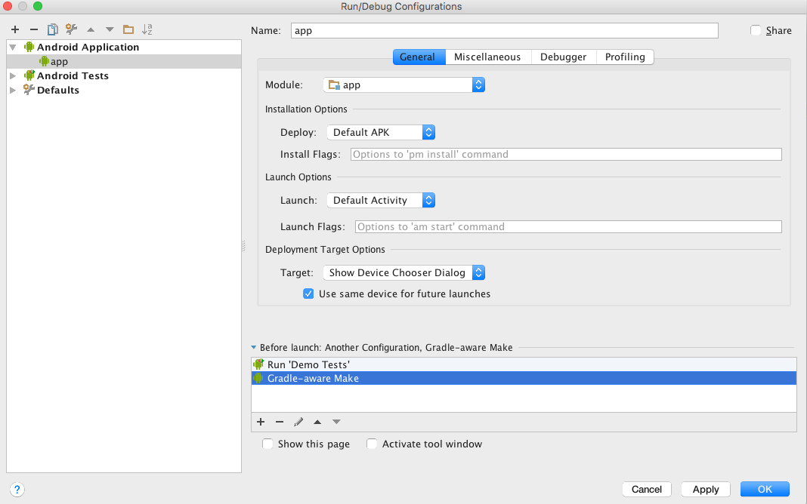

# EspressoDemo
UI testing with [Espresso](http://developer.android.com/training/testing/ui-testing/espresso-testing.html)

After cloning the project, make the following changes in Android Studio if you want to run your UI tests before each build

**Add a new Tests Configuration**

1. Go into Run -> Edit Configurations
2. Hit the + sign in the left corner above Android Application and choose Android Tests
3. Give your test configuration a name at the top in the **Name** field
4. Change the **Module** field to app
5. In the **specific instrumentation runner (optional)** field add this: **android.support.test.runner.AndroidJUnitRunner** (which is the testInstrumentationRunner name found in the app's build.gradle file). Then click OK
6. Go back under **Android Application** and select app
7. Hit the plus sign near the bottom and choose **Run Another Configuration**
8. Choose the name of your test configuration as given in step 3
9. Use the up/down arrows to move the **Gradle-aware Make** so that it appears after your new run configuration

